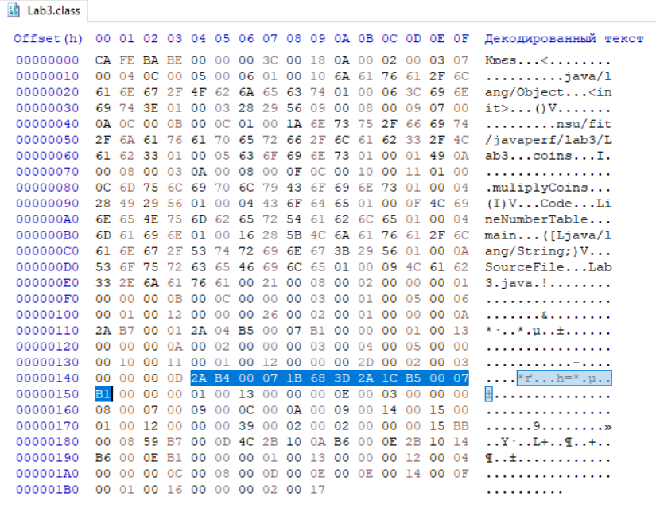

| bytecode instruction  | Octet  |
|-----------------------|--------|
| aload_0               |  0x2a  |
| getfield              |  0xb4  |
| iload_1               |  0x1b  |
| iload_2               |  0x1c  |
| imul                  |  0x68  |
| istore_2              |  0x3d  |
| putfield              |  0xd5  |
| return                |  0xb1  |


`multiplyCoins()` bytecode location:


```
  void muliplyCoins(int);
    Code:
       0: aload_0
       1: getfield      #7                  // Field coins:I
       4: iload_1
       5: imul
       6: istore_2
       7: aload_0
       8: iload_2
       9: putfield      #7                  // Field coins:I
      12: return
```
